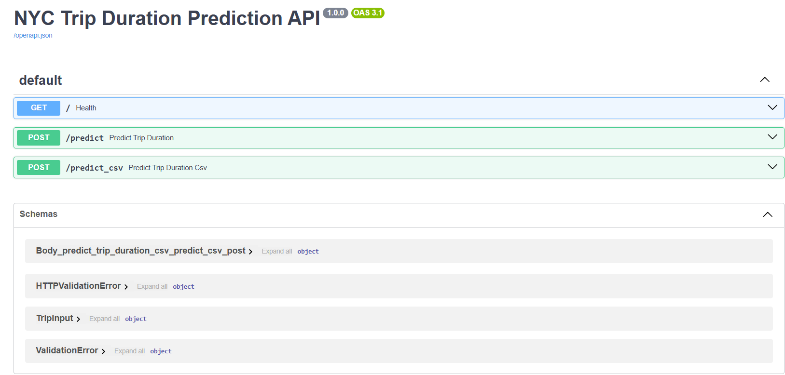
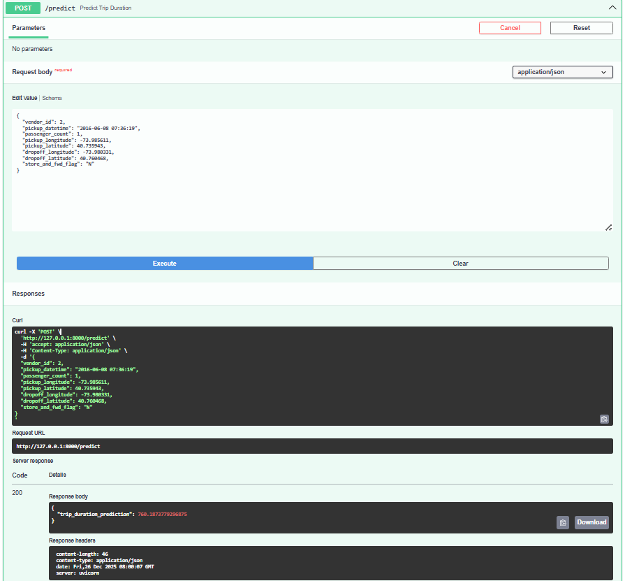
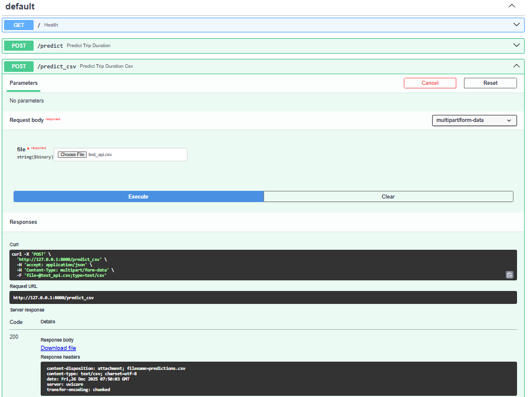
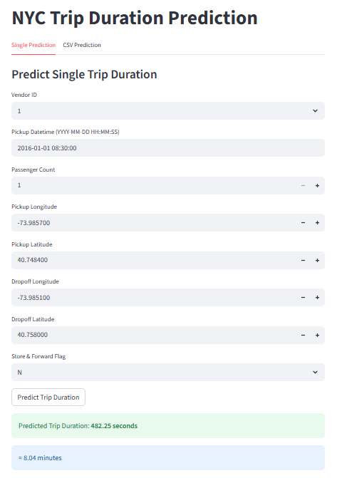
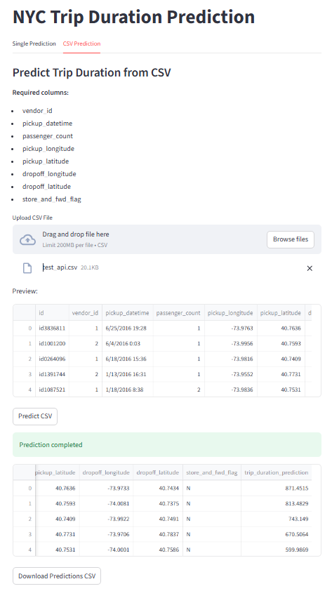

# NYC Trip Duraion

<h3>

This NYC-trip duration project  
it try to predict the duration for trips in New York by given 10 features and
1Millioon example for train and 200000 for val after doing feature
engineering and feature extraction and use model like linear
regression, ridge, neural network, xgboost we end up with best model
from xgboost regressor with f1-score: 76% for val & 72% for test

</h3>


### Features
***id*** - a unique identifier for each trip
  
***vendor_id*** - a code indicating the provider associated with the trip record  

***dropoff_datetime*** - date and time when the meter was disengaged  

***passenger_count*** - the number of passengers in the vehicle (driver entered value)  

***pickup_longitude*** - the longitude where the meter was engaged  

***pickup_latitude*** - the latitude where the meter was engaged  

***dropoff_longitude*** - the longitude where the meter was disengaged  

***dropoff_latitude*** - the latitude where the meter was disengaged  

***store_and_fwd_flag*** - This flag indicates whether the trip record was held in vehicle memory before sending to the vendor because the vehicle did not have a connection to the server - Y=store and forward; N=not a store and forward trip  

***trip_duration*** - duration of the trip in seconds  


### From EDA
- Original train_val contain 10 features
- drop `id` uselss feature 
- data are clean and just 6 dublicate examples 
- target feature
    - before remove outlier, very high skewness, upnormal plot
    - after remove outlier, the data in normal range, and almost guassian plot
- most of the passengers are 1 and 2 but there high outlier like 7 and 8
- we calculate haversine distance from longitude&latitude and got very good correlation with target feature 
- from datetime feature varation
    - Friday and Saturday is the most days that there are trips counts
    - most of the trips are after hour 18 (may be because this is after the working time)
    - other variations are not so important


```
NYC_TRIP_DURATION/
├── .venv/
├── src/
│   ├── config/
│   ├── data/
│   ├── enums/
│   ├── Frontend/
│   ├── logs/
│   ├── Model/
│   │   ├── Helper/
│   │   ├── Train/
│   │   └── model.py
│   ├── notebook/
│   ├── outputs/
│   ├── Processing/
│   ├── Testing/
│   ├── utils/
│   ├── .gitignore
│   ├── requirements.txt
│   ├── xgboost.pkl
│   └── __init__.py
├── __init__.py
├── main.py
└── README.md

```

## Usage

### 1- Clone Repository
```bash 
# change your_username with your username at github
git clone https://github.com/your_username/NYC_Trip_Duration.git
cd NYC_Trip_Duration
```

### 2- First check Python Installed
```bash 
python --version
# or
python3 --version
```
- if it doesn't installed install it from [python.org](https://www.python.org/downloads/)

### 3- Check pip installed
```bash
python -m pip --version
```

- if not installed, write 
```bash 
curl https://bootstrap.pypa.io/get-pip.py -o get-pip.py

python get-pip.py
```

### 4- create Virtual Machine (venv)
``` bash
# Linux/macOS
python3 -m venv venv

# Windows
python -m venv venv
```

### 5- Activate venv
```bash
# Linux/macOS
source venv/bin/activate

# Windows
.\.venv\Scripts\activate
```

### 6- Install Requirments
```bash
cd src 
# NYC_Trip_Duration/src
pip install -r requirements.txt
```

### 7- check Training
```bash
cd src 
# NYC_Trip_Duration/src
python -m Model.model
```

### 8- check testing
```bash
cd src 
# NYC_Trip_Duration/src
python -m Testing.test
```

### 9- run fast-api 
``` bash
# NYC_Trip_Duration
uvicorn main:app --reload
```
- then open ```http://127.0.0.1:8000/docs```
- fast-api screen should show like this 
<p style="text-align:center;">
  
</p>

- when open \post\predict and try to write test example 
```bash
{
  "vendor_id": 2,
  "pickup_datetime": "2016-06-08 07:36:19",
  "passenger_count": 1,
  "pickup_longitude": -73.985611,
  "pickup_latitude": 40.735943,
  "dropoff_longitude": -73.980331,
  "dropoff_latitude": 40.760468,
  "store_and_fwd_flag": "N"
}
```

- the expected output should show the trip duration prediction
- fast-api screen should show like this 
<p style="text-align:center;">
  
</p>

- when open \post\predict_csv and send csv file 
- it expected to send csv file with prediction
<p style="text-align:center;">
  
</p>
 

### 10- run frontend
```bash
# NYC_Trip_Duration
streamlit run src/Frontend/frontend.py
```
- open new Terminal and run streemlit 
- then open ``` http://localhost:8501/ ``` 
- predict single example 

<p style="text-align:center;">
  
</p>  

- predict csv file 
<p style="text-align:center;">
  
</p>

### Metrices:
  We focus on r2-score and mean square error (mse)  
  
### Results:
| Metric            | R2-score (val) | MSE (val) |
|-------------------|----------------|-----------|
| Linear regression | 0.6            | 0.226     |
| Ridge             | 0.59           | 0.232     |
| Neural Network    | 0.586          | 0.234     |
| Xgboost           | 0.76           | 0.134     |


The best model we choose for testing XGBoost that give in val: r2-
score: 0.76% and MSE: 0.134
And for test: r2score: 0.725 and MSE: 0.174
